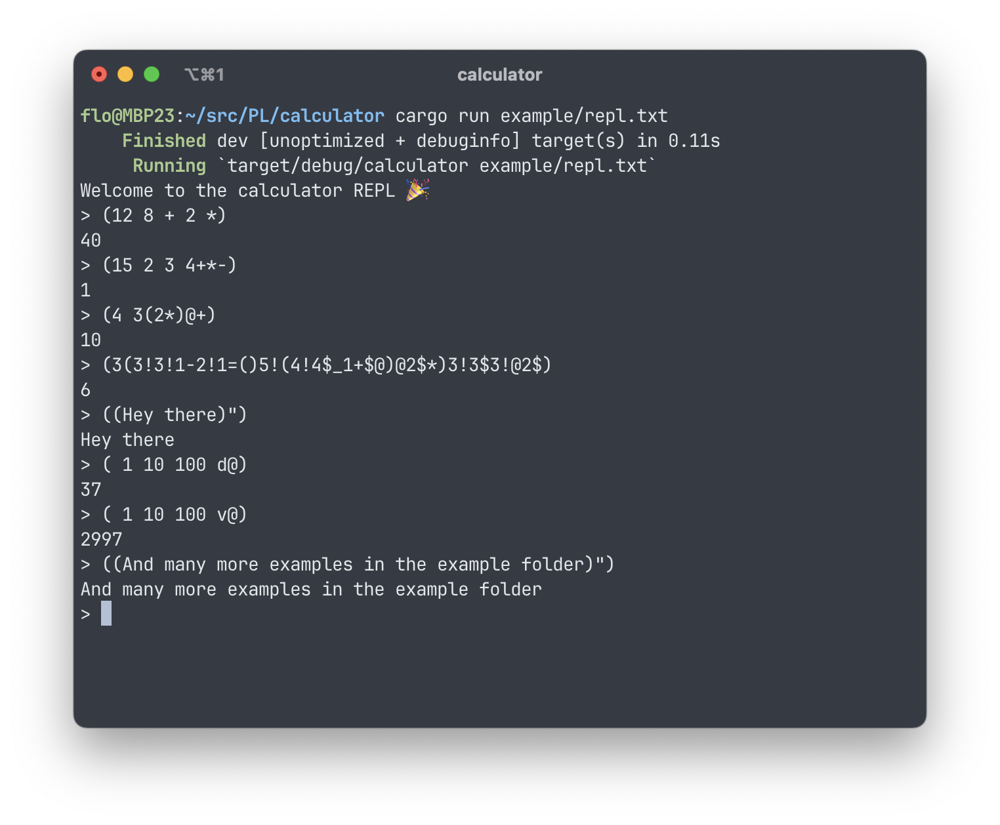

# Calculator



The calculator for [assignment1](https://tuwel.tuwien.ac.at/pluginfile.php/3542105/mod_folder/content/0/aufgabe1.pdf)
is written in [Rust](https://www.rust-lang.org/) and has no other dependencies.

## Build and run

```bash
cargo run example/single.txt
```

## Testing

You can run all the tests with `cargo test`.

## Development

We use `cargo fmt` for formatting and `cargo clippy` for linting.
clippy can also fix many cases by itself when invoked with `cargo clippy --fix`.

For VSCode you can use the [rust-analyzer](https://marketplace.visualstudio.com/items?itemName=rust-lang.rust-analyzer)
extension, but you have to [enable clippy manually](https://users.rust-lang.org/t/how-to-use-clippy-in-vs-code-with-rust-analyzer/41881).

## Debugging

For debugging the additional operator `^` exists which will print the complete 
stack.