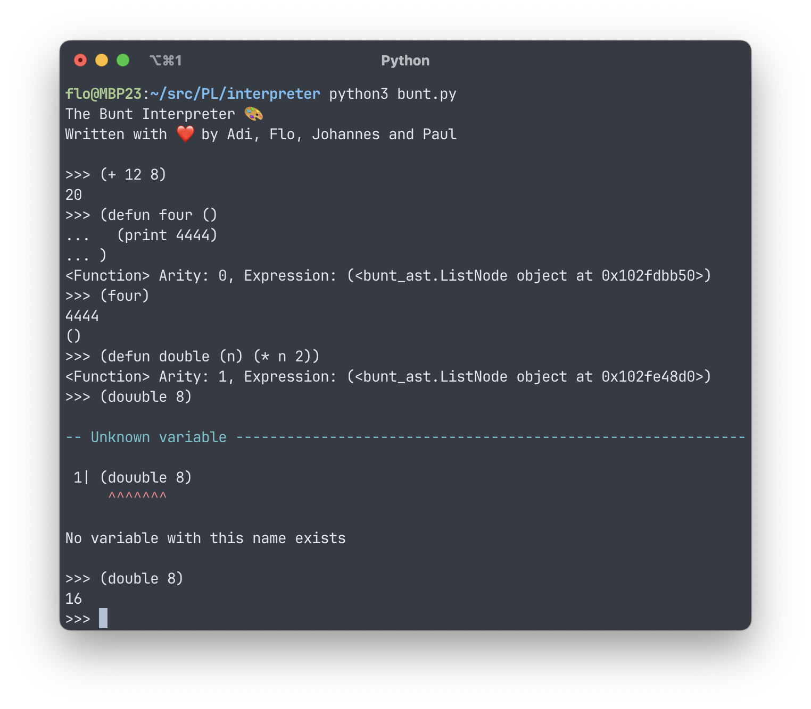

# Interpreter



The interpreter for [assignment2](https://tuwel.tuwien.ac.at/pluginfile.php/3542105/mod_folder/content/0/aufgabe2.pdf)
is written in [Python](https://www.rust-lang.org/) and only depends on pytest.

The language for the interpreter was designed by us and is quite simple.

## The Bunt Interpreter

The interpreter has a recurisve decent parser that generates an AST which is then interprated. It is therefore a Tree Walking Interpreter. 

### Build and Run

You need python 3.11 or later.

```sh
python3 -m venv venv
source venv/bin/activate
pip install -r requirements.tx
python bunt.py
```

### Usage

The interpreter will launch a REPL if no file argument is provided.

```bash
usage: python3 bunt.py [-h] [--dump-token] [--dump-ast] [filename]

The interpreter for the bunt programming language

positional arguments:
  filename      a file to execute

options:
  -h, --help    show this help message and exit
  --dump-token  dump all tokens and do not execute them
  --dump-ast    dump the ast and do not execute it
```

## Testing

You can run all tests with:

```sh
pytest
```

And generate a coverate report with:

```sh
coverage run -m pytest
coverage report -m
coverage html
```

## Pre-commit

For checks before committing

```sh
pre-commit install
```

## The Bunt Programming Language 🎨

A Lisp-like language that is small enough to fulfill the requirements.

### Types

- **Integers**
- **Boolean**
- **Lists:** Lists can hold different types, like in Python, and can even hold functions.
- **Functions:** Functions take zero or more arguments and always return a single value. "Void functions" simply return an empty list.

### Expressions

We use S-Expressions, for which Lisp is known:

```lisp
# Adds two numbers
(+ 2 4)
```

In Lisp, there is no point before line, the programmer has to specify the order with parentheses.

```lisp
# Equal to (3 + 5) * 7 in mathematics
(* (+ 3 5) 7)
```

### Lists

Sometimes you don't want the first argument to be a function so you can use the list function to return a list.

```lisp
(print (list 1 2 3))
```

Functions on lists always take the list last:

```lisp
# Return 3
(take 2 (list 1 2 3))
```

### Conditions

```lisp
# x will be 18 
(print (if (> 3 2) 18 17)))
```

### Lambda

To create an anonymous function, the lambda keyword can be used:

```lisp
# Fancy way to square 3
((lambda (a) (* a a)) 3)
```

### Variables

Variables are immutable and cannot be reassigned. You can create them with let which defines them in the enclosing scope.

```lisp
# A local variable
(let (god 42)
    (print (* god 2))
)
```

### Functions

Maybe, with defun in the future or just with let and lambda.

```lisp
(let (add (lambda (a b) (+ a b))
    (print (add 3 7)))
```

### Builtin functions

- Arithmetic functions: +,-,*,/,%
- Comparisons: <, >, =, <=, >=, and, or, not
- IO: print, println
- Lists: head, init, tail, last, drop, +
